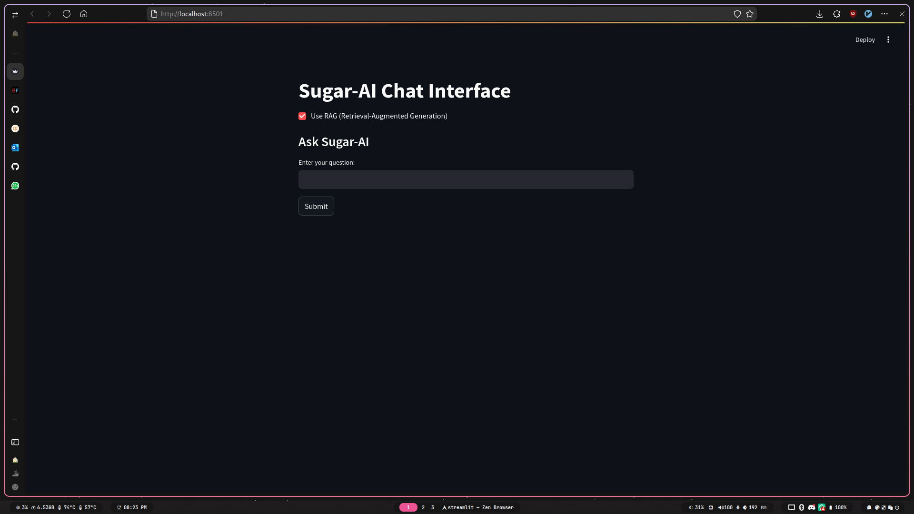

# Sugar-AI Project

This document describes how to run Sugar-AI, test recent changes, and troubleshoot common issues.

## Running Sugar-AI with Docker

Sugar-AI provides a Docker-based deployment option for an isolated and reproducible environment.

### Build the Docker image

Open your terminal in the project's root directory and run:

```sh
docker build -t sugar-ai .
```

### Run the Docker container

- **With GPU (using NVIDIA Docker runtime):**

    ```sh
    docker run --gpus all -it --rm sugar-ai
    ```

- **CPU-only:**

    ```sh
    docker run -it --rm sugar-ai
    ```

The container starts by executing `main.py`. To change the startup behavior, update the Dockerfile accordingly.

## Testing the FastAPI App

The FastAPI server provides endpoints to interact with Sugar-AI.

### Install dependencies

```sh
pip install -r requirements.txt
```

### Run the server

```sh
uvicorn main:app --host 0.0.0.0 --port 8000
```

### Test API endpoints

- **GET endpoint**

    Access the root URL:  
    [http://localhost:8000/](http://localhost:8000/) to see the welcome message.

- **POST endpoint for asking questions**

    To submit a coding question, send a POST request to `/ask` with the `question` parameter. For example:

    ```sh
    curl -X POST "http://localhost:8000/ask?question=How%20do%20I%20create%20a%20Pygame%20window?"
    ```

    The API returns a JSON object with the answer.

- **Additional POST endpoint (/ask-llm)**

    An alternative endpoint `/ask-llm` is available in `main.py`, which provides similar functionality with an enhanced processing pipeline for LLM interactions. To use it, send your coding-related question using:

    ```sh
    curl -X POST "http://localhost:8000/ask-llm?question=How%20do%20I%20create%20a%20Pygame%20window?"
    ```

    The response format is JSON containing the answer generated by the language model.

- The RAG Agent has been updated with improvements for handling requests and retrieving relevant documents.
- The assistant now uses a more streamlined prompt and processing pipeline.
- You can choose to run the model with or without 4‑bit quantization using the `--quantize` flag.

### Running the RAG Agent from the Command Line

To test the new RAG Agent directly from the CLI, execute:

```sh
python rag_agent.py --quantize
```

Remove the `--quantize` flag if you prefer running without 4‑bit quantization.

### Testing the New Features

1. **Verify Model Setup:**
     - Confirm the selected model loads correctly by checking the terminal output for any errors.
     
2. **Document Retrieval:**
     - Place your documents (PDF or text files) in the directory specified in the default parameters or provide your paths using the `--docs` flag.
     - The vector store is rebuilt every time the agent starts. Ensure your documents are well placed to retrieve relevant content.

3. **Question Handling:**
     - After the agent starts, enter a sample coding-related question.
     - The assistant should respond by incorporating context from the loaded documents and answering your query.
     
4. **API and Docker Route:**
     - Optionally, combine these changes by deploying the updated version via Docker and testing the FastAPI endpoints as described above.

## Troubleshooting CUDA Memory Issues

If you encounter CUDA out-of-memory errors, consider running the agent on CPU or adjust CUDA settings:

```sh
export PYTORCH_CUDA_ALLOC_CONF=expandable_segments:True
```

Review the terminal output for further details and error messages.

## Using the Streamlit App

Sugar-AI also provides a Streamlit-based interface for quick interactions and visualizations.

### Running the Streamlit App

1. **Install Streamlit:**

    If you haven't already, install Streamlit:

    ```sh
    pip install streamlit
    ```

2. **Make sure server is running using:**
    ```sh
    uvicorn main:app --host 0.0.0.0 --port 8000
    ```

3. **Start the App:**

    Launch the Streamlit app by adding streamlit.py file.
    ```python
    #./streamlit.py
    import streamlit as st
    import requests

    st.title("Sugar-AI Chat Interface")

    use_rag = st.checkbox("Use RAG (Retrieval-Augmented Generation)", value=True)

    st.subheader("Ask Sugar-AI")
    question = st.text_input("Enter your question:")

    if st.button("Submit"):
        if question:
            if use_rag:
                url = "http://localhost:8000/ask"
            else:
                url = "http://localhost:8000/ask-llm"
            params = {"question": question}
            try:
                response = requests.post(url, params=params)
                if response.status_code == 200:
                    result = response.json()
                    st.markdown("**Answer:** " + result["answer"])
                else:
                    st.error(f"Error {response.status_code}: {response.text}")
            except Exception as e:
                st.error(f"Error contacting the API: {e}")
        else:
            st.warning("Please enter a question.")
    ```

    ```sh
    streamlit run streamlit.py
    ```

4. **Using the App:**

    - The app provides a simple UI to input coding questions and displays the response using Sugar-AI.
    - Use the sidebar options to configure settings if available.
    - The app communicates with the FastAPI backend to process and retrieve answers.



Enjoy exploring Sugar-AI through both API endpoints and the interactive Streamlit interface!
